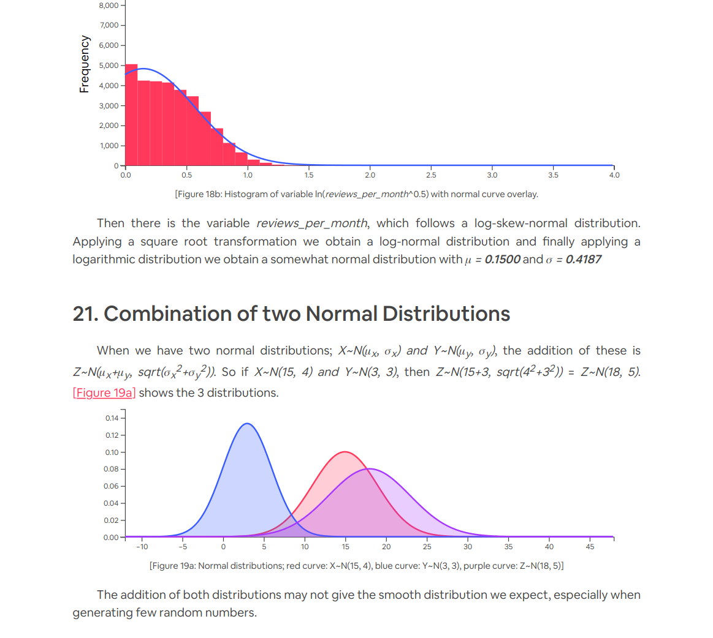
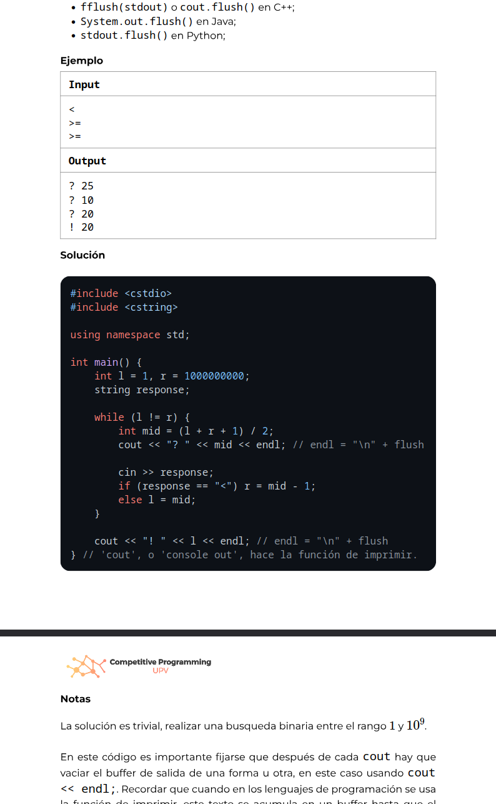
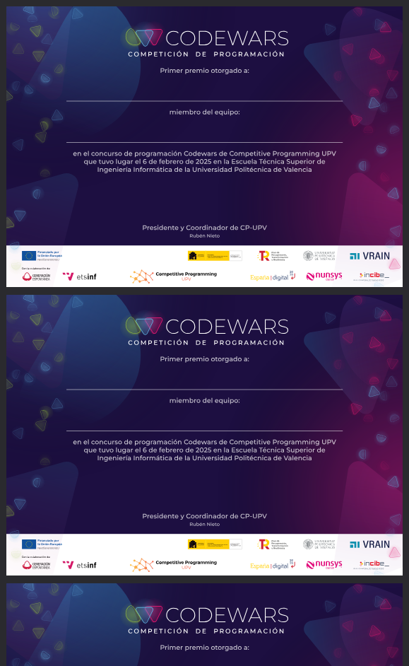

Tired of Word or equivalent software for writing documents? Use vanilla HTML/CSS/JS instead! This is just a web directory that serves as a template with predefined styles to quickly get started

## Samples

## Features

- Customize the appearence of the document as you please, this is just a template to get you started
- Support for highlight.js, MathJax (LaTeX) and D3.js by default
- Add new js libraries to fit your needs (such as three.js to insert 3D graphics)
- Create any PDF you can imagine using only a text editor and web browser (reports, slides, invoices, certificates...)
- Useful for creating bulk documents with custom data per file
- If your text editor has live reloading, such as VSCode with 'Live Server' you can watch your changes instantly
- Support for title page, constant header and footer across pages

## How to use

1. Download the project as a .zip file and uncompress it anywhere.
2. Using your text editor of your choice (VSCode/Sublime/Notepad/Vim...) modify `html/document.html`, create or modify CSS rules, insert images and custom fonts, create js scripts for content preprocessing
3. Open document.html in your web browser and hit `Ctrl + P` (make sure you disable margins and default headers and footers, and print backgrounds)

## Help needed

- Minimalistic and flexible approach for placing page numbers in the footer
- Better README.md